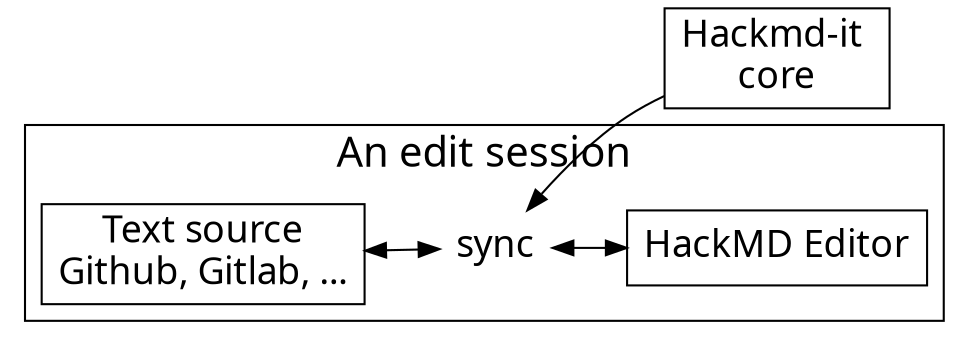

# Git and GitHub
## Computational workshop on version control

- Diego Alonso Álvarez
- Sandra Álvarez Carretero

---

## Tips and instructions

1. Code along - you will learn more! :computer: 
2. Ask questions - any time! :question: 
3. Follow on the resources (see next page) :books: 

---

## Resources

- [Fundamentals of Git/GitHub](https://imperialcollegelondon.github.io/introductory_grad_school_git_course/)
- [Further Git/GitHub for collaboration](https://imperialcollegelondon.github.io/intermediate_grad_school_git_course/)
- [Referencing and citing content](https://docs.github.com/en/repositories/archiving-a-github-repository/referencing-and-citing-content)


---

## Outline

- What is version control and why does it matter?
- The publication workflow
- Fundamentals of `git`
- Sharing code/data in GitHub
- Make your work citable

---

## Publication workflow

How do we ensure that our code/data is **findable**?

--

[**The FAIR Guiding Principles for scientific data management and stewardship**. Sci Data 3, 160018 (2016)](https://doi.org/10.1038/sdata.2016.18) 

--

[**Introducing the FAIR Principles for research software**. Sci Data 9, 622 (2022)](https://doi.org/10.1038/s41597-022-01710-x)

----

Some concepts

`commit` :arrow_forward: `tag` :arrow_forward: Release :arrow_forward: DOI

----

Which look like

`dkfo344` :arrow_forward: `v0.2.5` :arrow_forward: `v0.2.5` + metadata 
:arrow_forward: 10.5281/zenodo.1185315

----

Implemented by

`git` :arrow_forward: `git` :arrow_forward: GitHub :arrow_forward: Zenodo

---

### 70% of our users are developers. Developers :heart: GitHub.

---



---

### Usage flow

---




---

### Architecture of extension

---


---

## Content script

- Bind with each page
- Manipulate DOM
- Add event listeners
- Isolated JavaScript environment
  - It doesn't break things

---

# :fork_and_knife: 

---

<style>
code.blue {
  color: #337AB7 !important;
}
code.orange {
  color: #F7A004 !important;
}
</style>

- <code class="orange">onMessage('event')</code>: Register event listener
- <code class="blue">sendMessage('event')</code>: Trigger event

---

# :bulb: 

---

- Dead simple API
- Only cares about application logic

---

```typescript
import * as Channeru from 'channeru'

// setup channel in different page environment, once
const channel = Channeru.create()
```

---

```typescript
// in background script
const fakeLogin = async () => true

channel.answer('isLogin', async () => {
  return await fakeLogin()
})
```

<br>

```typescript
// in inject script
const isLogin = await channel.callBackground('isLogin')
console.log(isLogin) //-> true
```

---

# :100: :muscle: :tada:

---

### Wrap up

- Cross envornment commnication
- A small library to solve messaging pain
- TypeScript Rocks :tada: 

---

### Thank you! :sheep: 

You can find me on

- GitHub
- Twitter
- or email me
